## STOREFRONT BACKEND PROJECT

### SETUP

## ENVIRONMENT VARIABLES AND APP SETUP

Please, create an environemnt file namely `.env` at the root of the project and provide the following info:

        POSTGRES_HOST=127.0.0.1

        POSTGRES_DB=storefront
        POSTGRES_TEST_DB=storefront_test

        POSTGRES_USER=*****
        POSTGRES_PASSWORD=*****

        ENV=dev

        BYCRYPT_PASSWORD=*****
        SALT_ROUNDS=*****
        TOKEN_SECRET=*****

Information about the PostgreSQL user and password is provided below. The BYCRYPT_PASSWORD is used as pepper with the user generated password for hashing and SALT_ROUNDS is for rounding the hashed password.
I provided sample code below as an example:

        const pepper = process.env.BYCRYPT_PASSWORD;
        const saltRounds = '' + process.env.SALT_ROUNDS;

        const hashedPassword = bcrypt.hashSync(
            u.password + pepper,
            parseInt(saltRounds)
        );

We use `TOKEN_SECRET` for the JWT signin and verification. This can be any random string and provided by
the programmer. The `POSTGRES_HOST` is the host information where we would like to run the app; if we
desired to run the app in the location host we can provide `127.0.0.1` as input. The `POSTGRES_DB` and
`POSTGRES_DB_TEST` are respectively the development and test database. The `ENV` variable is for which mode we would like to run the application.

We will need to install all the node packages that are required for the project using the comamnd:

        $ npm install

## DATABASE SETUP AND MIGRATION

Now, we are ready to setup the databases required for the project. In OS X, run the PostgreSQL database in as background service with the command that will run in the DB in the port 5432:

        $ pg_ctl -D /usr/local/var/postgres start

We can also run the database in the same port using brew:

        $ brew services start postgresql

For the purpose, we will need to run and later, connect with the PostgreSQL daatbase running the command from terminal:

        $ psql postgres

Then, we will need to create a database for the application namly `storefront` and another for testing
namely `storefront_test` for the user `arefe` with the command provided:

        <!-- create the dataabses -->
        postgres=# CREATE DATABASE storefront;
        postgres=# CREATE DATABASE storefront_test;

        <!-- create an user -->
        postgres=# CREATE USER arefe WITH ENCRYPTED PASSWORD 'udacity';

        <!-- provide the user access for the databases -->
        postgres=# GRANT ALL PRIVILEGES ON DATABASE storefront TO arefe;
        postgres=# GRANT ALL PRIVILEGES ON DATABASE storefront_test TO arefe;

At the moment, we are ready for the databse migration and creating the tables. WE can do that using the
command provided:

        <!-- this command will create the tables in the develpment database -->
        $ yarn dev_up

In case, if we would like to drop these tables and start over, we can run the command:

        <!-- this will drop the tables in the primary database -->
        $ yarn dev_down

## TESTING

We can run the tests using the comamnd:

        $ yarn test

If test(s) failed, the test database will not be dropped and we will need to manually reset before we can proceed again:

        $ db-migrate --env test reset

## START APPS

We can start the app using any of the command provided:

        $ yarn start
        $ yarn watch

The above command will start the app at the port of 3000. A postman collection is provided named
StorefrontAPI.postman_collection.json that can be user for inspection of the app. The setup for the
authetication need to be accordingly.

## SETUP THE BEARER TOKEN

Setup Bearer token in the headers

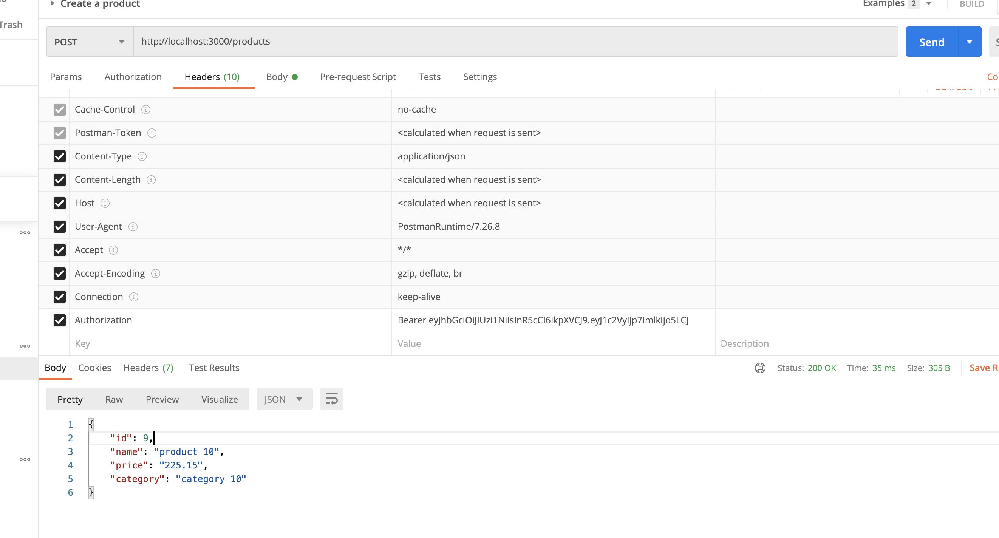

Set Authetication Type: No Auth in the Postman

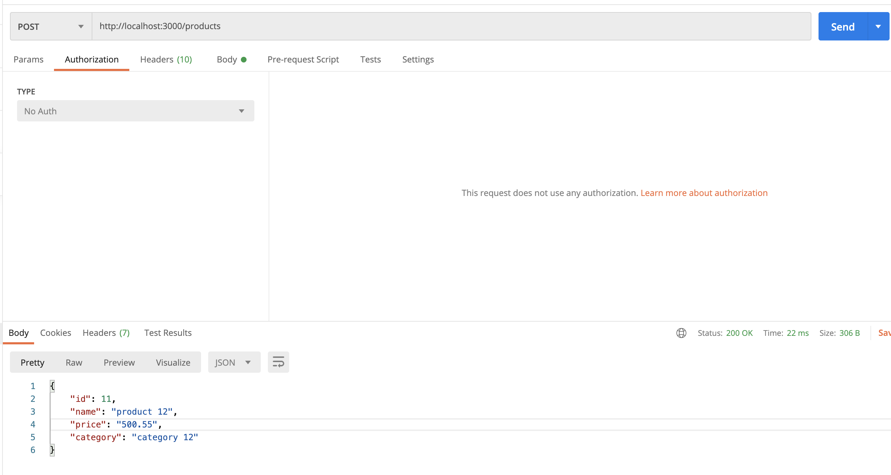

## POSTMAN API CALLS

## USERS

Create an user: ADMIN (token is generated)

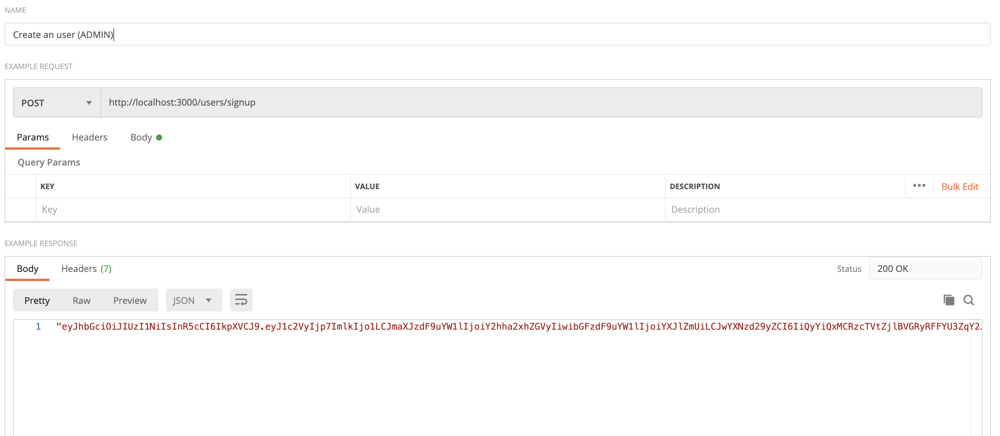

Login an user: ADMIN (username and password required and token generated)

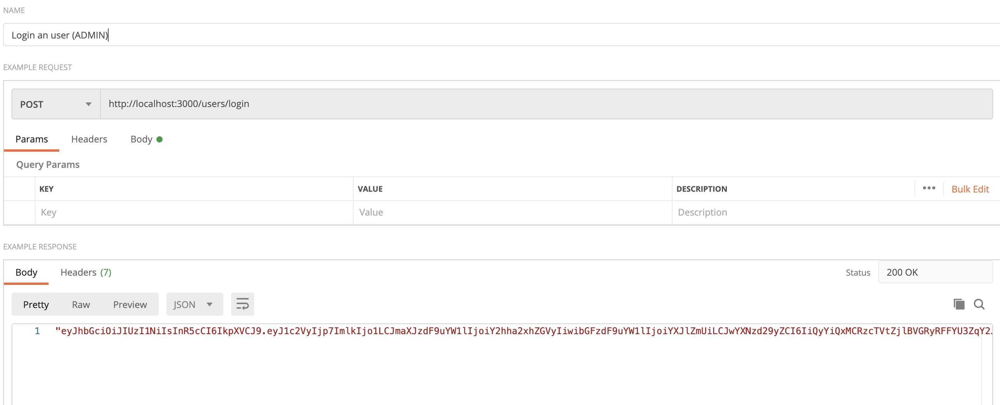

Create an user :COMMUNITY (token is generated)

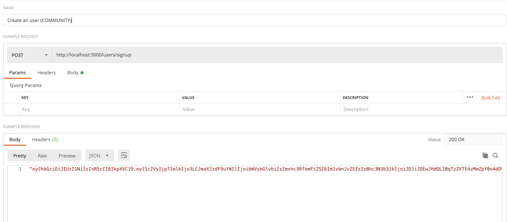

Login an user: COMMUNITY (username and password required and token generated)

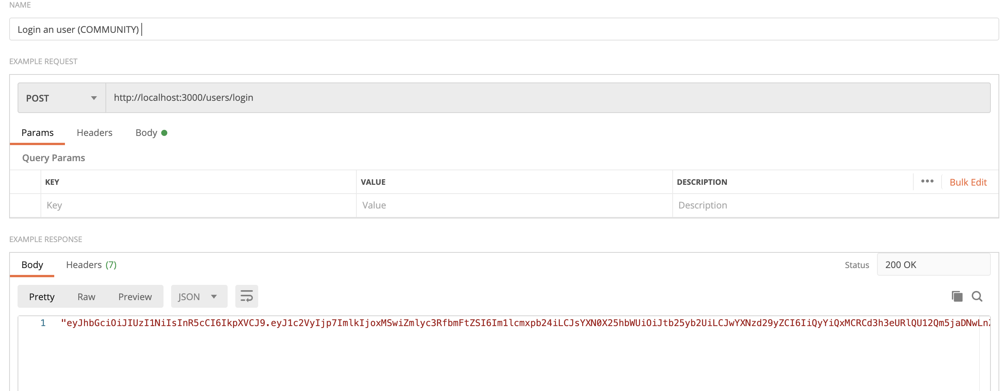

Index all users (token required - both ADMIN and COMMUNITY have access)

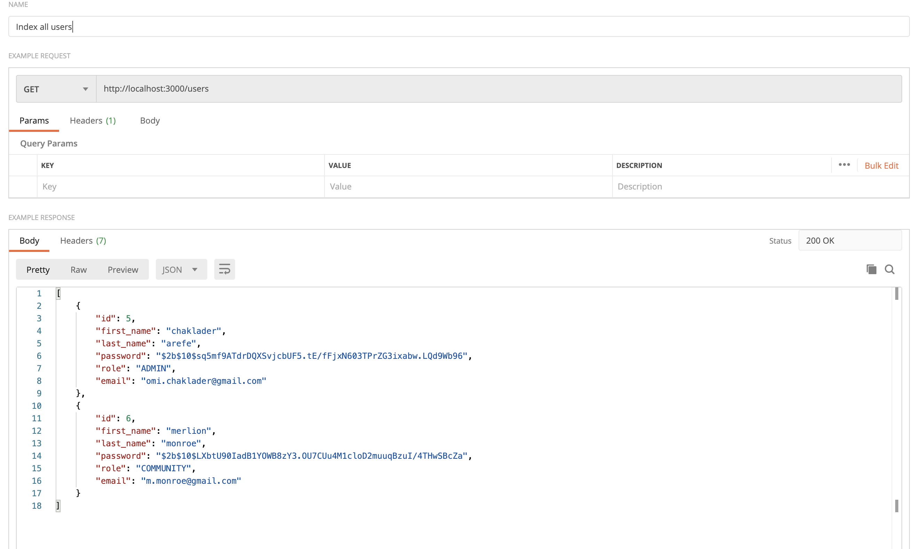

Show an user (token required - both ADMIN and COMMUNITY have access)

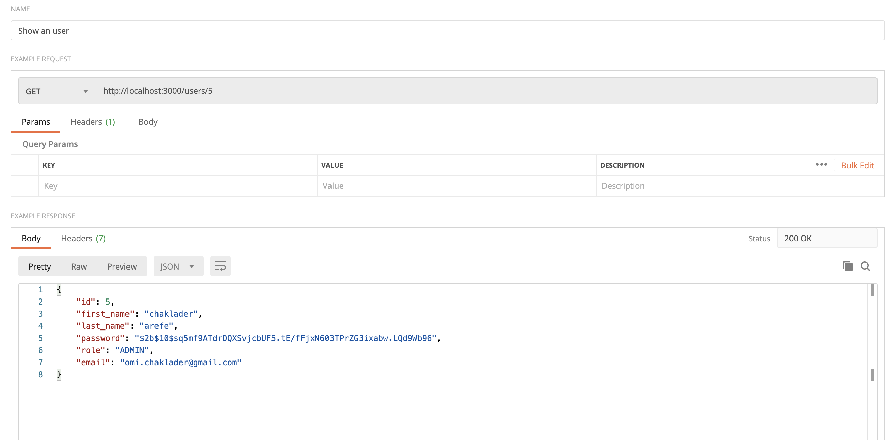

Update an user (token required - only the respective user can do it)

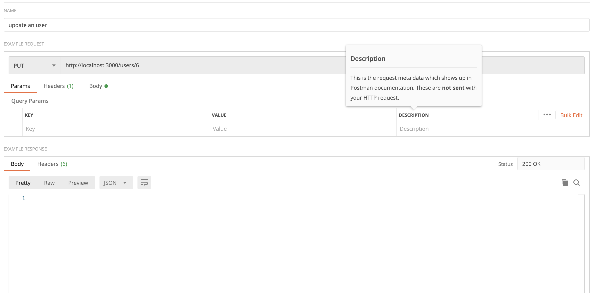

Delete an user (token required - only ADMIN have access)

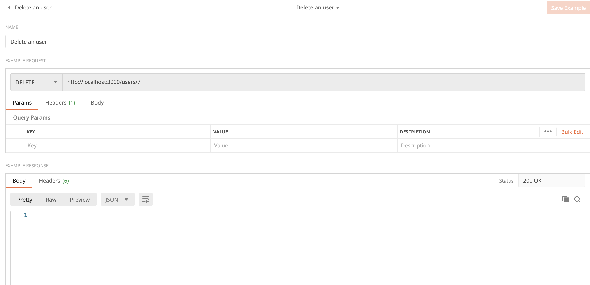

## PRODUCTS

Create a product (toekn required)

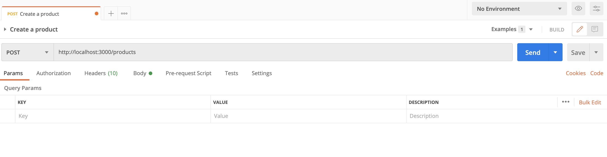

Index all products

Show a product by ID

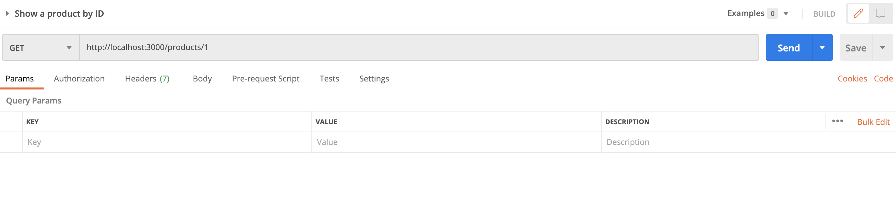

Delete a product

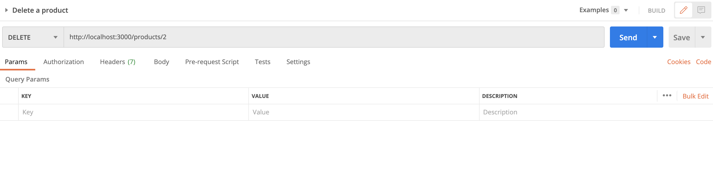

Show products by category

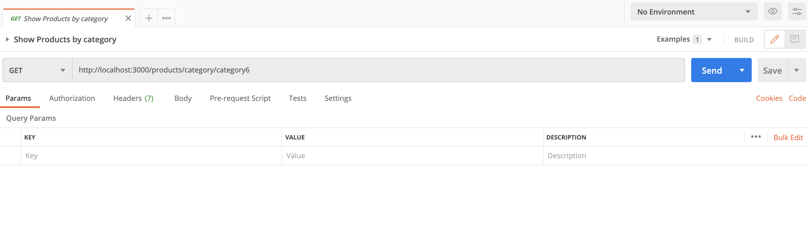

## ORDERS

Create an order (token required)

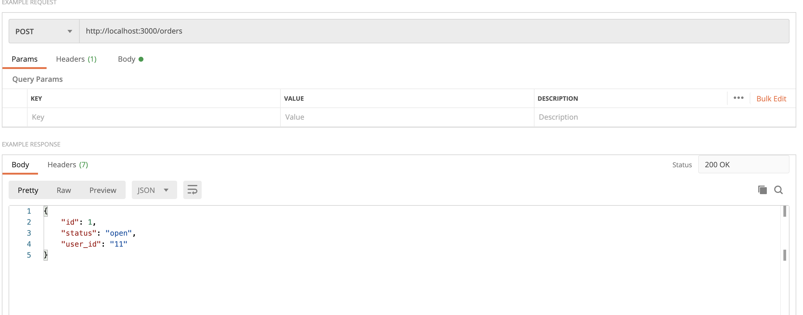

Index all orders

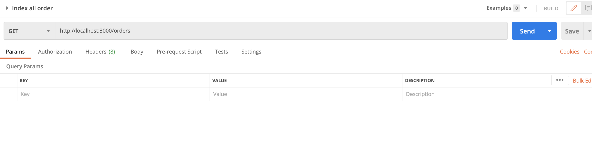

Show an order

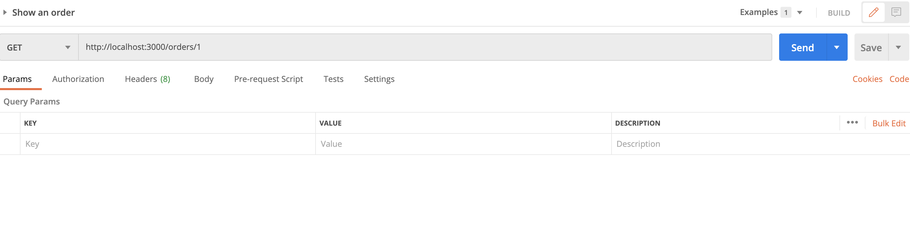

Delete an order

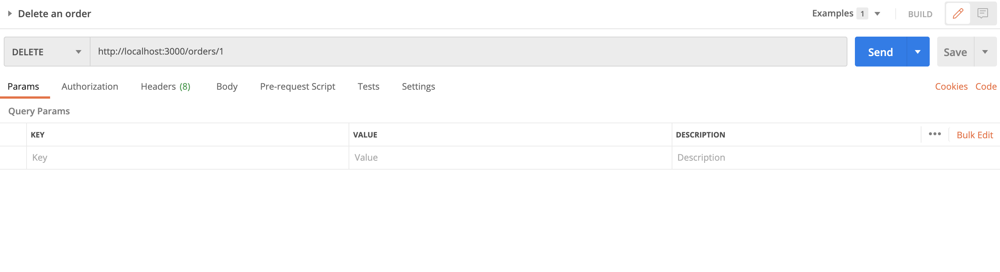

Add products to an order

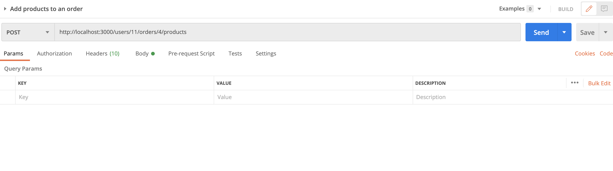

## REST END POINTS AND DB SHAPES

The documentation can be found in the in the REQUIREMENTS.md file.

### TODO

    - Provide the Swagger REST API documentation
    - Run with the docker

## TECHNOLOGIES

Your application must make use of the following libraries:

-   Postgres for the database
-   Node/Express for the application logic
-   dotenv from npm for managing environment variables
-   db-migrate from npm for migrations
-   jsonwebtoken from npm for working with JWTs
-   jasmine from npm for testing

## STEPS FOR COMPLETION

### 1. Plan to Meet Requirements

In this repo there is a `REQUIREMENTS.md` document which outlines what this API needs to supply for the frontend, as well as the agreed upon data shapes to be passed between front and backend. This is much like a document you might come across in real life when building or extending an API.

Your first task is to read the requirements and update the document with the following:

-   Determine the RESTful route for each endpoint listed. Add the RESTful route and HTTP verb to the document so that the frontend developer can begin to build their fetch requests.  
    **Example**: A SHOW route: 'blogs/:id' [GET]

-   Design the Postgres database tables based off the data shape requirements. Add to the requirements document the database tables and columns being sure to mark foreign keys.  
    **Example**: You can format this however you like but these types of information should be provided
    Table: Books (id:varchar, title:varchar, author:varchar, published_year:varchar, publisher_id:string[foreign key to publishers table], pages:number)

**NOTE** It is important to remember that there might not be a one to one ratio between data shapes and database tables. Data shapes only outline the structure of objects being passed between frontend and API, the database may need multiple tables to store a single shape.

### 2. DB Creation and Migrations

Now that you have the structure of the databse outlined, it is time to create the database and migrations. Add the npm packages dotenv and db-migrate that we used in the course and setup your Postgres database. If you get stuck, you can always revisit the database lesson for a reminder.

You must also ensure that any sensitive information is hashed with bcrypt. If any passwords are found in plain text in your application it will not pass.

### 3. Models

Create the models for each database table. The methods in each model should map to the endpoints in `REQUIREMENTS.md`. Remember that these models should all have test suites and mocks.

### 4. Express Handlers

Set up the Express handlers to route incoming requests to the correct model method. Make sure that the endpoints you create match up with the enpoints listed in `REQUIREMENTS.md`. Endpoints must have tests and be CORS enabled.

### 5. JWTs

Add JWT functionality as shown in the course. Make sure that JWTs are required for the routes listed in `REQUIUREMENTS.md`.

### 6. QA and `README.md`

Before submitting, make sure that your project is complete with a `README.md`. Your `README.md` must include instructions for setting up and running your project including how you setup, run, and connect to your database.

Before submitting your project, spin it up and test each endpoint. If each one responds with data that matches the data shapes from the `REQUIREMENTS.md`, it is ready for submission!
