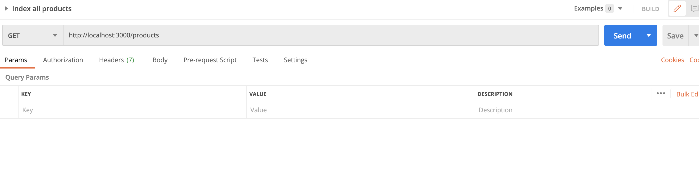
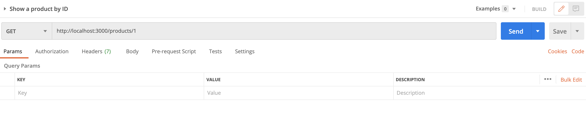
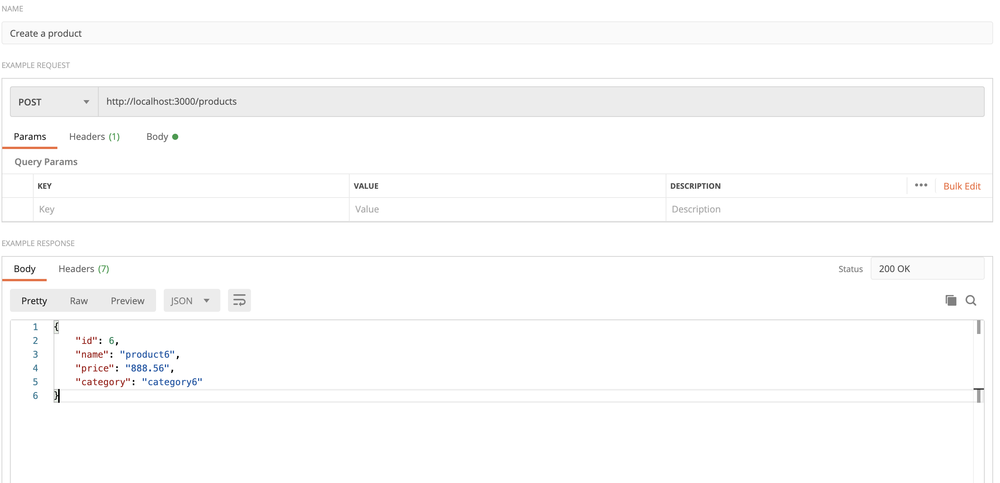
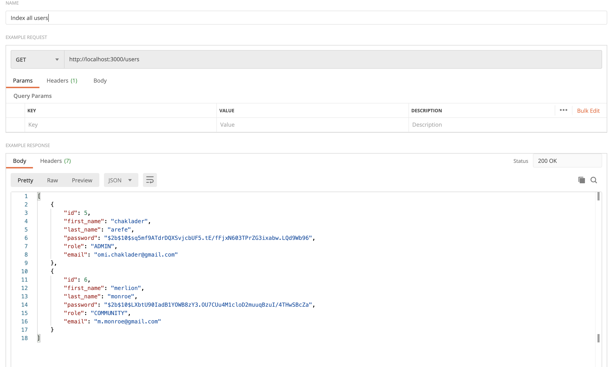

# API REQUIREMENTS

The company stakeholders want to create an online storefront to showcase their great product ideas. Users need to be able to browse an index of all products, see the specifics of a single product, and add products to an order that they can view in a cart page. You have been tasked with building the API that will support this application, and your coworker is building the frontend.

These are the notes from a meeting with the frontend developer that describe what endpoints the API needs to supply, as well as data shapes the frontend and backend have agreed meet the requirements of the application.

## API ENDPOINTS

#### PRODUCTS

-   Index

    GET http://localhost:3000/products

    

-   Show

    GET http://localhost:3000/products/:productId

    

-   Create [token required]

    POST http://localhost:3000/products

    Payload example:

        {
            "id": 6,
            "name": "product6",
            "price": "888.56",
            "category": "category6"
        }

    Only an user with ADMIN role can create a product

    

-   [OPTIONAL] Top 5 most popular products

    GET http://localhost:3000//five-most-popular

-   [OPTIONAL] Products by category (args: product category)

    GET http://localhost:3000/products/category/:category

    

#### USERS

-   Index [token required]

    -   both users with role ADMIN and COMMUNITY can index with token

    GET http://localhost:3000/users

    

-   Show [token required]

    -   both users with role ADMIN and COMMUNITY can show with token

    GET http://localhost:3000/users/:userId

    

-   Create N[token required]

    -   user with ADMIN role (JWT token will be generated)

    POST http://localhost:3000/users/signup

    Payload example:

        {
            "firstName": "chaklader",
            "lastName": "arefe",
            "password": "password",
            "role": "ADMIN",
            "email": "omi.chaklader@gmail.com"
        }

    

    -   user with COMMUNITY role (JWT token will be generated)

    POST http://localhost:3000/users/signup

    Payload example:

        {
            "firstName": "merlion",
            "lastName": "monroe",
            "password": "password_updated",
            "role": "COMMUNITY",
            "email": "m.monroe@gmail.com"
        }

    

#### ORDERS

-   Current Order by user (args: user id)[token required]

    -   only the respective user can see their current orders after token validation

    GET http://localhost:3000/show-current-orders/:userId

-   [OPTIONAL] Completed Orders by user (args: user id)[token required]

    -   only the respective user can see their current orders after toekn validation

    GET http://localhost:3000/show-completed-orders/:userId

## Data Shapes

#### Product

-   id
-   name
-   price
-   [OPTIONAL] category

  

#### User

-   id
-   firstName
-   lastName
-   password

#### Orders

-   id
-   id of each product in the order
-   quantity of each product in the order
-   user_id
-   status of order (active or complete)

