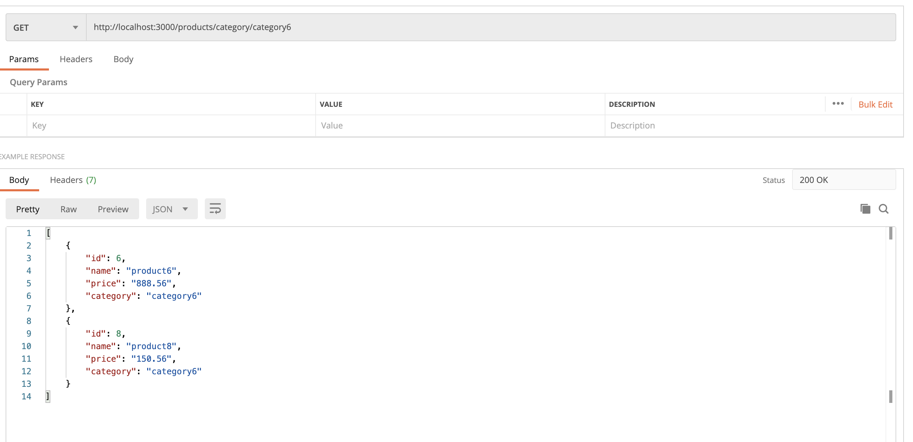
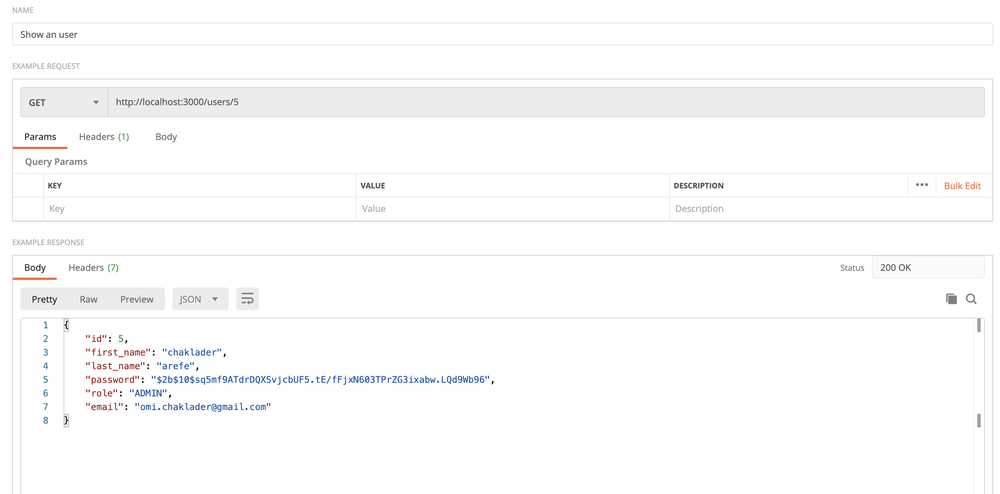
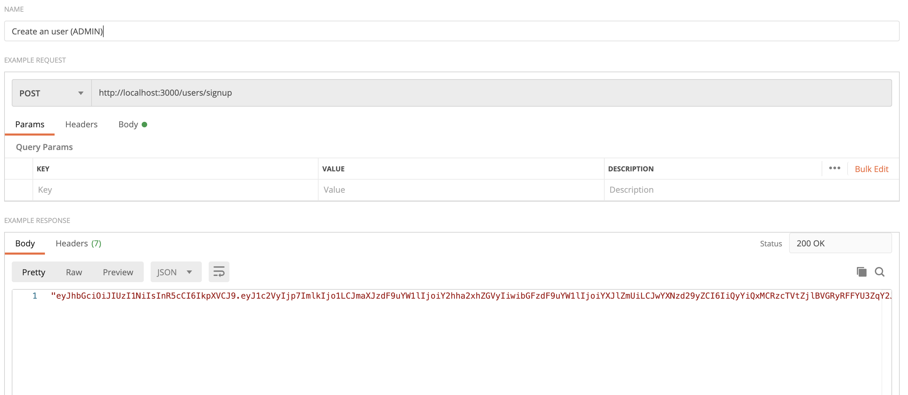

# API REQUIREMENTS

The company stakeholders want to create an online storefront to showcase their great product ideas. Users need to be able to browse an index of all products, see the specifics of a single product, and add products to an order that they can view in a cart page. You have been tasked with building the API that will support this application, and your coworker is building the frontend.

These are the notes from a meeting with the frontend developer that describe what endpoints the API needs to supply, as well as data shapes the frontend and backend have agreed meet the requirements of the application.

## API ENDPOINTS

#### PRODUCTS

-   Index

    GET http://localhost:3000/products

    

-   Show

    GET http://localhost:3000/products/:productId

    

-   Create [token required]

    POST http://localhost:3000/products

    Payload example:

        {
            "id": 6,
            "name": "product6",
            "price": "88",
            "category": "category6"
        }

    Only an user with ADMIN role can create a product

    

-   [OPTIONAL] Top 5 most popular products

    GET http://localhost:3000//five-most-popular

-   [OPTIONAL] Products by category (args: product category)

    GET http://localhost:3000/products/category/:category

    

#### USERS

-   Index [token required]

    -   both users with role ADMIN and COMMUNITY can index with token

    GET http://localhost:3000/users

    

-   Show [token required]

    -   both users with role ADMIN and COMMUNITY can show with token

    GET http://localhost:3000/users/:userId

    

-   Create N[token required]

    -   user with ADMIN role (JWT token will be generated)

    POST http://localhost:3000/users/signup

    Payload example:

        {
            "firstName": "chaklader",
            "lastName": "arefe",
            "password": "password",
            "role": "ADMIN",
            "email": "omi.chaklader@gmail.com"
        }

    

    -   user with COMMUNITY role (JWT token will be generated)

    POST http://localhost:3000/users/signup

    Payload example:

        {
            "firstName": "merlion",
            "lastName": "monroe",
            "password": "password_updated",
            "role": "COMMUNITY",
            "email": "m.monroe@gmail.com"
        }

    

#### ORDERS

    Create

        POST http://localhost:3000/orders

        an order can only be created by the respective user after the token validation
        and the order status needs to be set as "open". The respective payload example:

            {
                "userId": 1,
                "status": "open"
            }

        The reason status needs to be open as it doesn't make sense if we are creating an order and
        the initial status is set as "closed"

    Add Products to an Order

        only the respective user will be able to add more products to their order after the token validation.
        We will add the products to an order if the status is "open". For the same order and the products user
        can change their quantity and update the order. The data will be stored in the table named 'order_products'.

            POST http://localhost:3000/users/:userId/orders/:orderId/products

            The payload example can be:

                {
                    "quantity": "700",
                    "productId":"1"
                }

        This means the user with ID `:userId` would like to add 700 quantity of product of ID 1 to the order with ID `:orderId`

        The response example can be:

            {
                "id": 1,
                "quantity": 1000,
                "order_id": "1",
                "product_id": "1"
            }

    Delete

        None but the respective user can delete their own order after token validation

            DELETE http://localhost:3000/orders/:orderId

Current Order by user (args: user id)[token required]

        only the respective user can see their current orders after token validation

        GET http://localhost:3000/show-current-orders/:userId

    Completed Orders by user (args: user id)[token required]

        only the respective user can see their current orders after toekn validation

        GET http://localhost:3000/show-completed-orders/:userId

### DASHBOARDS

5 Most popular products

    This is provide 5 most popular products considering all the orders based on the quantity ascending oder. No token validation is required for the quiry. The REST endpoint is provided:

        GET http://localhost:3000/five-most-popular

    An example resposce can be:

        [
            {
                "id": 3,
                "name": "product5",
                "price": 150,
                "category": "category5",
                "quantity": 2000,
                "order_id": "5",
                "product_id": "5"
            },
            {
                "id": 1,
                "name": "product7",
                "price": 150,
                "category": "category7",
                "quantity": 1000,
                "order_id": "7",
                "product_id": "7"
            },
            {
                "id": 2,
                "name": "product6",
                "price": 150,
                "category": "category6",
                "quantity": 1000,
                "order_id": "6",
                "product_id": "6"
            },
            {
                "id": 4,
                "name": "product5",
                "price": 150,
                "category": "category5",
                "quantity": 500,
                "order_id": "6",
                "product_id": "5"
            },
            {
                "id": 5,
                "name": "product5",
                "price": 150,
                "category": "category5",
                "quantity": 200,
                "order_id": "7",
                "product_id": "5"
            }
        ]

## DATA SHAPES

#### Product

-   id
-   name
-   price
-   [OPTIONAL] category

#### User

-   id
-   firstName
-   lastName
-   password

#### Orders

-   id
-   id of each product in the order
-   quantity of each product in the order
-   user_id
-   status of order (active or complete)

